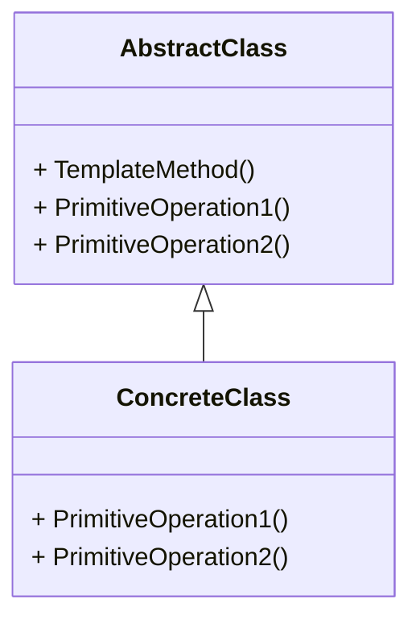

# 案例
有一个稳定的执行流程, 分为5个步骤, 其中步骤2和4存在变化的可能

# 有问题的做法
- 库开发人员只开发步骤1/3/5
- 库使用者负责开发步骤2/4, 并写好整个流程
- 这种方式属于早绑定, 用户程序调用库

[代码](no_template.cpp)

# 模板方法
- 将流程封装到库中
- 方法2/4作为虚函数留给使用者实现
- 这种方式属于晚绑定, 库(流程函数)调用用户程序重写的方法

[代码](template.cpp)

# 定义
定义一个操作中的算法骨架(稳定), 而将一些步骤(变化)延迟到子类中. 模板方法使得子类可以不改变(复用)一个算法的结构即可重定义(重写)该算法的某些特定步骤.

# 要点总结
- 模板方法是一种非常基础的设计模式, 利用了虚函数的多态性为很多应用程序框架提供了灵活的扩展点

- "不要调用我, 我来调用你"的反向控制结构是模板方法的典型应用

- 一般推荐将虚方法设置为protected