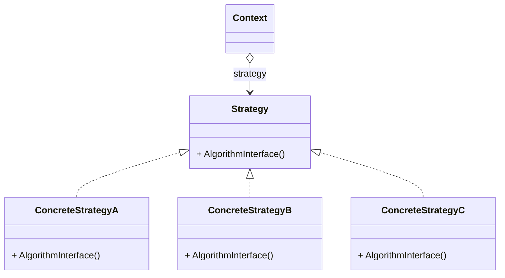

# 动机
- 在软件构建过程中, 某些对象使用的算法可能多种多样, 经常改变, 如果将这些算法都编码到对象中, 将会使对象变得异常复杂; 而且有时候支持不使用的算法也是一个性能负担. 
- 如何在运行时根据需要透明地更改对象的算法? 将算法与对象本身解耦, 从而避免上述问题? 

# 应用场景案例
## 问题描述: 计算各国税率
使用一个类来完成各国税率的计算. 在类中使用枚举类型判断计算哪国税率, 并调用具体的实现. 

需要在时间轴上动态地评判这种方法. 假设以后会出现的变化是需要新增对一国税率计算的支持, 那么在代码中有两处需要发生变化: 

1. 枚举类型中的国家代号
2. 税率计算中新的分支

## 通常做法
使用枚举值和分支语句, 枚举值用于确定计算哪国税率, 分支语句中包含具体的计算实现
每次添加一个新的国家时, 需要同时添加: 
1. 枚举值
1. 分支实现

[代码](no_pattern.cpp)

## 策略模式做法
将每种计算方法封装成一个派生类, 在计算的位置调用其基类方法, 这样可以保持计算的逻辑不变. 每次新增方法就新增一个派生类. 只需要在调用的时候确定使用哪种方法, 构造其派生类对象即可, 之后的计算逻辑完全一致.

[代码](strategy.cpp)

# 定义
定义一系列算法, 把它们一个个封装起来, 并且使它们可以互相替换. 该模式使得算法可独立于使用它的客户程序(稳定)而变化.

# 要点总结
- 如果条件分支确定不会有扩展, 如一周7天的不同逻辑, 可以直接使用条件分支而非策略模式. 如果业务会不断扩展, 就考虑使用策略模式
- 使用策略模式的业务类聚合了策略模式的基类指针. 在案例中, 就是在需要计算税率的销售订单类中聚合了基类指针. 聚合该指针的地方不需要知道具体有哪些策略类型, 只需要调用公共接口即可. 具体的策略类型由更高层调用决定. 
- 策略模式还可以减少程序开销。如果有一些方法永远不会被使用，那就永远不会被加载。但之前的方法很多判断分支都还是会被加载. 
