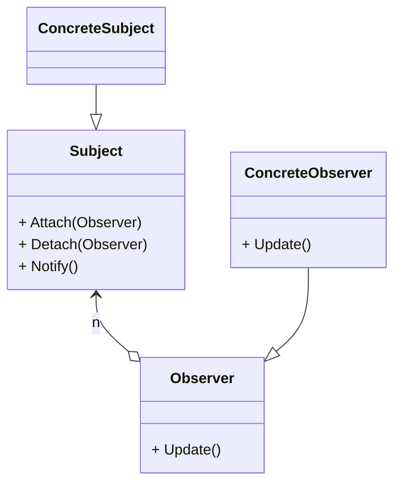

# 动机
- 在软件构建过程中, 我们需要为某些对象建立一种"通知依赖关系": 一个对象(目标对象)的状态发生改变, 所有的依赖对象(观察者对象)都将得到通知. 如果这样的依赖关系过于紧密, 将使软件不能很好地抵御变化.
- 使用面向对象技术, 可以将这种依赖关系弱化, 并形成一种稳定的依赖关系, 从而实现软件体系结构的松耦合. 

# 应用场景案例
## 问题描述: 文件分割器
文件分割器接受窗体输入框输入的文件路径和分割数量, 当窗体发生鼠标点击事件时调用分割器, 执行分割方法. 现在需要增加需求, 在分割的过程中显示进度条.

### 有问题的做法
- 实现方式
在文件分割器中增加进度条成员, 然后在分割方法中增加改变进度条的代码. 
进度条由主窗口创建, 作为参数传递给分割器
[代码](wrong_method.cpp)

- 问题
这种做法违背了依赖倒置原则, 高层模块不应该依赖于实现细节, 二者都应该依赖于抽象. 分割器就不应该依赖于进度条, 可能下个需求是通过文字表示进度百分比, 或者程序需要跨平台, 不使用这类控件来展示进度.

### 方法改进
- 写一个进度的抽象接口, 这个接口通过一个表示进度的值, 执行显示进度的方法, 但需要派生类去具体实现. 
- 在文件分割器中维护一个进度抽象接口的容器, 可以添加或删除接口. 在文件分割时, 调用容器中的每个抽象接口进行进度更新.
    可以将对进度接口的调用放到一个单独的虚函数中, 便于文件分割器的派生类进行实现的重写. 

- 在窗体中使用多继承, 增加了对进度条接口的继承, 并且具体实现了显示进度的方法. 这样窗体本身就是一个具体的进度(IS-A). 
    C++中不太推荐使用类的多继承, 但多继承允许继承一个具体类和多个抽象接口. 这里的窗体就是多继承了进度条接口. 
    在代码案例中, 没有体现多继承. 在原讲义中, 窗体的继承关系如下
    ```c++
    class MainForm: public Form, public IProgress
    ```

[代码](observer_event.cpp)

### 方法小结
MainForm在此次的案例中, 作为具体的观察者, 在状态变化时被通知. 


# 定义
定义对象间的一种一对多(变化)的依赖关系, 以便当一个对象(Subject)的状态发生变化时, 所有依赖于它的对象(Observer)都得到通知并自动更新. 



# 要点总结
- 观察者模式是UI框架中非常常用的设计模式, 也是MVC模式的重要组成部分
- Subject和Observer都依赖于抽象接口, Subject在状态变化时调用接口更新状态, 更新的具体实现由每一个具体的接口派生类负责. 
- 可以独立地改变目标和观察者, 从而使二者之间实现松耦合
- 目标发送通知时, 无需指定观察者, 通知会自动传播
- 观察者自己决定是否订阅通知, 目标对象(Subject)对此一无所知. 目标对象只需要提供订阅和退订的接口
