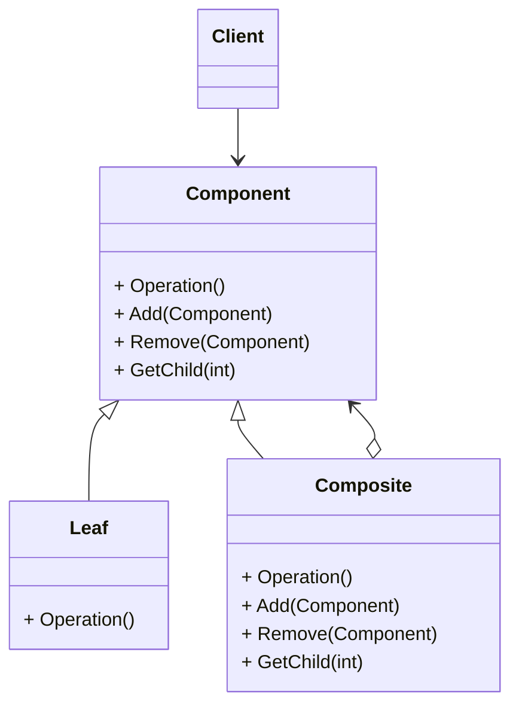
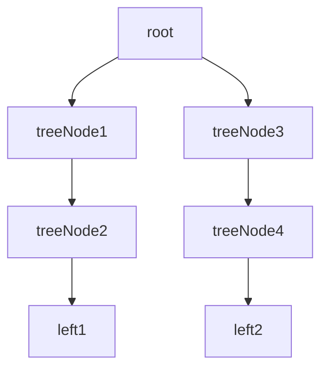

# 动机
- 软件在某些情况下, 客户代码过多地依赖于对象容器复杂的内部实现结构, 对象容器内部实现结构的变化将引起客户代码的频繁变化, 带来了代码的维护性、扩展性等弊端

- 如何将"客户代码与复杂的对象容器结构"解耦? 让对象容器自己来实现自身的复杂结构, 从而使得客户代码就像处理简单对象一样来处理复杂的对象容器

# 模式定义
将对象组合成树形结构以表示"部分-整体"的层次结构. 组件模式使得用户对单个对象和组合对象的使用具有一致性(稳定). 

# 代码示例
这里统一使用一个派生节点, 没有单独派生叶节点, 作为叶节点时不会调用子节点的操作函数.

案例中的树形结构如下

[代码](composite.cpp)

# 要点总结
- 组合模式就是用树形结构来表示对象的复杂结构