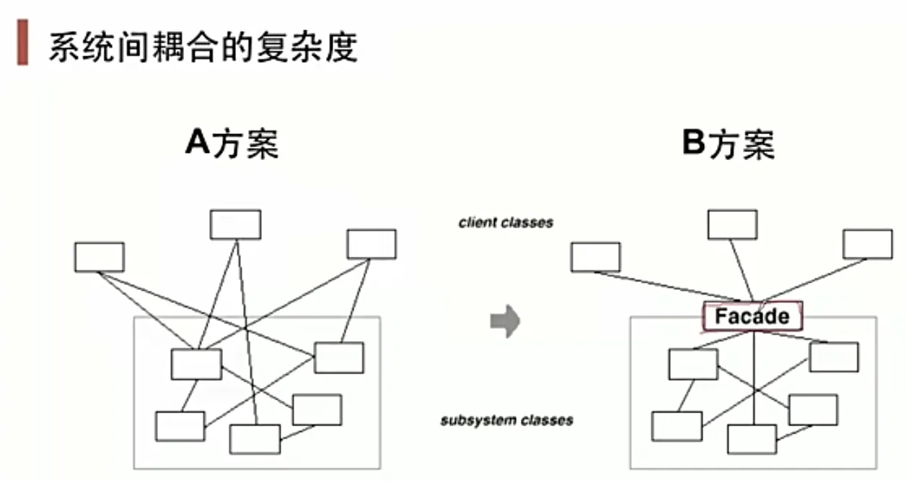

# 动机

- 上述A方案的问题在于组件的客户和组件中各种复杂的子系统有了过多的耦合, 随着外部客户程序和各子系统的演化, 这种过多的耦合面临很多变化的挑战
- 如何简化外部客户程序和系统间的交互接口? 如何将外部客户程序的演化和内部子系统的变化之间的依赖相互解耦? 

# 定义
为子系统中的一组接口提供一个一致(稳定)的界面, 门面模式定义了一个高层接口, 这个接口使得这一子系统更加容易使用(复用)

门面模式是一种架构设计模式, 并不是单个类的模式, 现实中可能代码结构相差很大, 因此没有总结类图

# 要点总结
- 对外提供规范化的接口, 保持接口稳定, 内部可以快速迭代. 可以理解成电脑机箱
- 要上升到架构层次来看待这种模式, 而非简单的类的层次