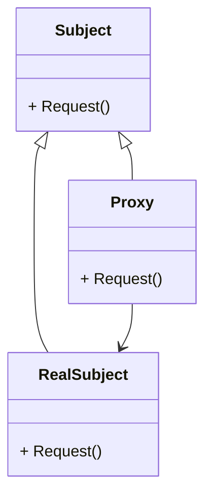

# 动机
- 在面向对象系统中, 有些对象由于某种原因(比如对象创建的开销很大, 或者某些操作需要安全控制, 或者需要进程外的访问等), 直接访问会给使用者或系统结构带来很多麻烦

- 如何在不失去透明操作对象的同时, 来管理/控制这些对象特有的复杂性? 增加一层间接层是软件开发中常见的解决方式

# 定义
为其他对象提供一种代理以控制(隔离, 使用接口)对这个对象的访问

# 代码示例

# 要点总结
- 增加一层间接层是软件系统中对许多复杂问题的一种常见解决方法
- 代理模式并不一定要求保持接口完整的一致性. 有时允许损失一些透明性, 只要能实现间接控制
- 代理模式常见的应用包括
    1. 写时复制
    
        读访问时只需要指针, 写时需要创建一个副本

    1. 分布式
    1. 案例访问控制