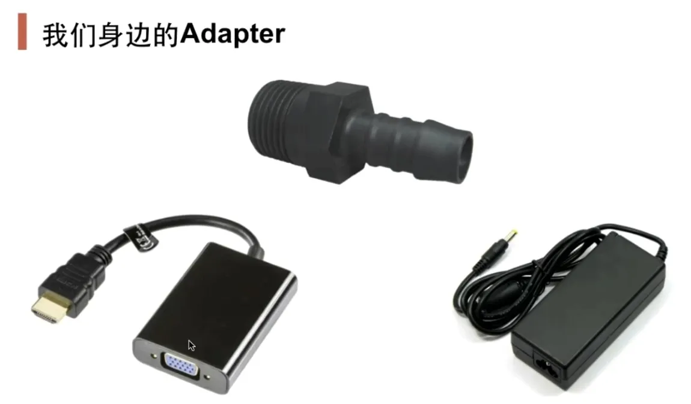

# 动机
- 在软件系统中, 由于应用环境的变化, 常常需要将"一些现存的对象"放在新的环境中应用, 但是新环境要求的接口是这些现存对象所不满足的

- 如何应对这种"迁移的变化"? 如何既能利用现有对象的良好实现, 同时又能满足新的应用环境所要求的接口? 

# 定义


# 代码示例
## 问题描述
- 已知老接口和新接口
- 新接口的调用通过对老接口的调用组合而成

## 实现方式
- 将老接口组合到新接口的派生类中

[代码](adapter.cpp)

## 不推荐的类适配器
```c++
// 多继承老接口
class Adapter : public ITarget, protected IAdaptee
{
};
// 多继承老接口的派生类
class Adapter : public ITarget, protected OldClass
{
};
```

# 要点总结
- 适配器模式主要用于"希望复用一些现存的类, 但是接口又与复用环境要求不一致的情况", 在遗留代码复用、类库迁移等方面非常有用
- GoF23定义了对象适配器和类适配器, 对象适配器就是上面[例子](#实现方式)中将老接口组合在新接口内部的方式. 类适配器采用多继承, 一般不推荐使用
- 适配器模式可以不局限于上面说的两种, 可以根据实际需要灵活使用
- STL中的stack和queue就是通过适配器转化了deque的接口

