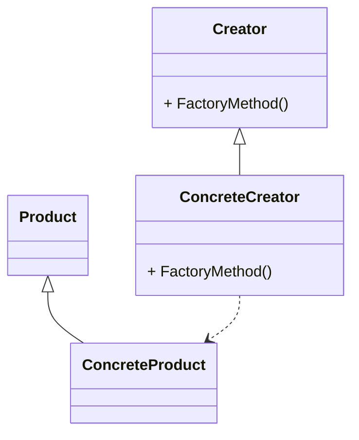

# 动机
- 在软件系统中, 经常面临着创建对象的工作; 由于需求的变化, 需要创建的对象的具体类型经常变化. 
- 如何应对这种变化? 如何绕过常规的对象创建方法(new), 提供一种"封装机制"来避免客户程序和这种"具体对象创建工作"的紧耦合? 

# 应用场景举例
## 问题描述
还是采用[文件分割器](<../../component collaboration/03-Observer_Event/>)的例子. 在鼠标点击事件中收集信息, 并使用new创建一个文件分割器进行分割. 
不同类型的文件可能都有一个自己的文件分割器, 如文本文件分割器, 图片文件分割器, 等等. 根据[策略模式](../../component%20collaboration/02-Strategy/), 不同的文件分割器可以使用不同的派生类实现. 

## 现有问题
虽然构造的对象指针使用虚基类指针来代替, 但new语句仍然依赖于具体的类. 
[代码](no_factory.cpp)

## 工厂方法
- 定义一个工厂类, 用于创建对象并返回其指针, 这样在创建对象的调用点可以不依赖于具体的派生类
- 将工厂定义为虚基类, 将其对具体类的依赖延迟到未来
- 针对每一个业务派生类, 定义一个工厂方法派生类与之对应
[代码](factory.cpp)

## 代码小结
工厂方法就是把决定创建的具体类型推到了代码的更上层. 在创建的位置不决定创建什么类, 这样可以保持这部分代码的稳定.
看下面的代码案例, 展示工厂方法是如何实现创建位置和创建类型的解耦的
```c++
FileSplitter *splitter = new BinarySplitter(); //两边都依赖具体实现
ISplitter *splitter = new BinarySplitter(); //左边为接口，右边仍然依赖具体实现
ISplitter *splitter = factory->CreateSplitter(); //两边都不依赖具体实现，factory也是接口，在需要时传入具体工厂的指针
```

# 定义
定义一个用于创建对象的接口, 让子类决定实例化哪一个类. 工厂方法使得一个类的实例化延迟到子类. 



# 要点总结
- 工厂方法模式用于隔离类对象的使用者和具体类型之间的耦合关系. 面对一个经常变化的具体类型, 紧耦合关系(new)会导致软件的脆弱
- 工厂方法模式通过面向对象的手法, 将所要创建的具体对象工作延迟到子类, 从而实现一种扩展(而非更改)的策略, 较好地解决了这种紧耦合关系. 
- 工厂方法模式解决"单个对象"的需求变化. 缺点在于要求创建方法/参数相同. 