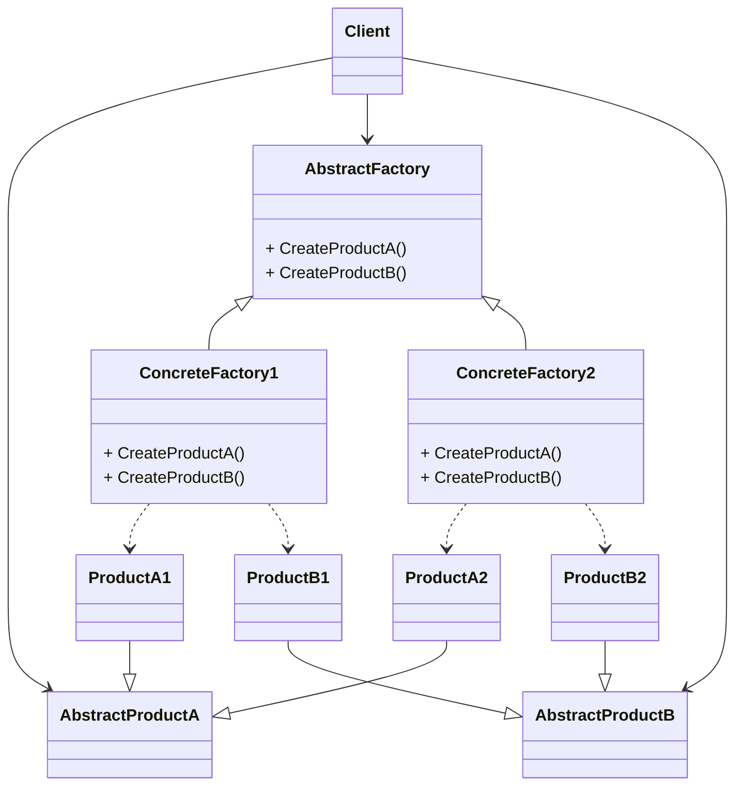

# 动机
- 结合[工厂方法](<../06-Factory Method/>)容易理解, 区别在于抽象工厂解决的是一系列相互依赖的对象的创建工作

# 应用场景
## 工厂方法的缺点
以数据库访问为例, 需要创建connection, command等多个业务对象. 可能会用到不同的数据库, 比如SQL Server, Oracle等

如果使用工厂方法模式, 每个对象都需要有一个工厂. 在给工厂传参的时候需要保证这些工厂都对应同一个数据库实例. 但实际上有错乱的可能. 

[代码](factory.cpp)

## 抽象工厂改进
将一系列相关的创建方法放到同一个工厂类中, 这个类存在多个接口, 分别用于创建不同的业务对象

[代码](abstract_factory.cpp)

# 定义
提供一个接口, 让该接口负责创建一系列"相关或者相互依赖的对象", 无需指定它们具体的类. 

# 要点总结
- 工厂模式的泛化, 相比之下工厂模式属于特例, 只同时创建一类对象. 抽象工厂可以同时创建一系列相关的对象.
