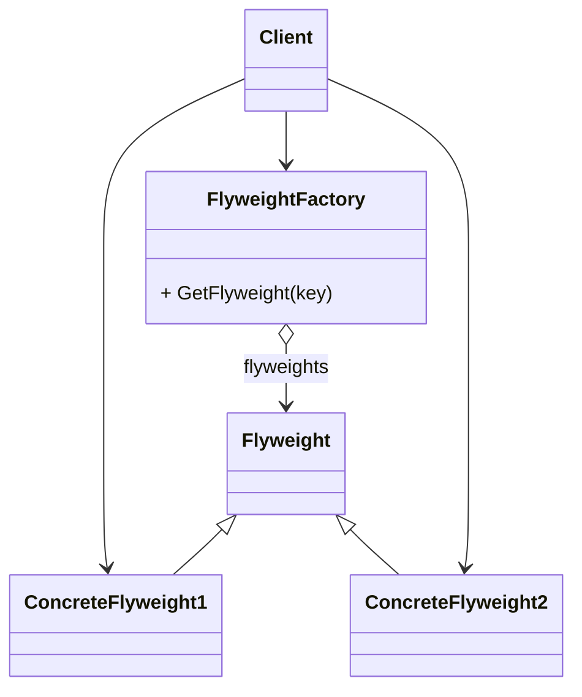

# 概述
# 动机
- 在软件系统采用纯粹对象方案的问题在于大量细粒度的对象会很快充斥在系统中, 从而带来很高的运行时代价(主要指内存需求方面的代价)
- 如何避免大量细粒度对象问题的同时, 让外部客户程序仍然能够透明地使用面向对象的方式来进行操作? 

# 案例
这是一个架空场景. 有一个文字处理系统, 每一个字体都是一个对象
有一个字体工厂. 每次需要字体对象时, 都会先查找字体对象是否已存在于字体池中. 存在则直接返回, 否则创建后加入字体池, 再返回.

[代码](flyweight.cpp)

# 定义 
运用共享技术有效地支持大量细粒度的对象

# 要点总结 
- 享元模式主要解决代价问题, 而非面向对象的抽象性问题
- 采用对象共享的做法来降低系统中对象的个数, 从而降低细粒度对象给系统带来的内存压力