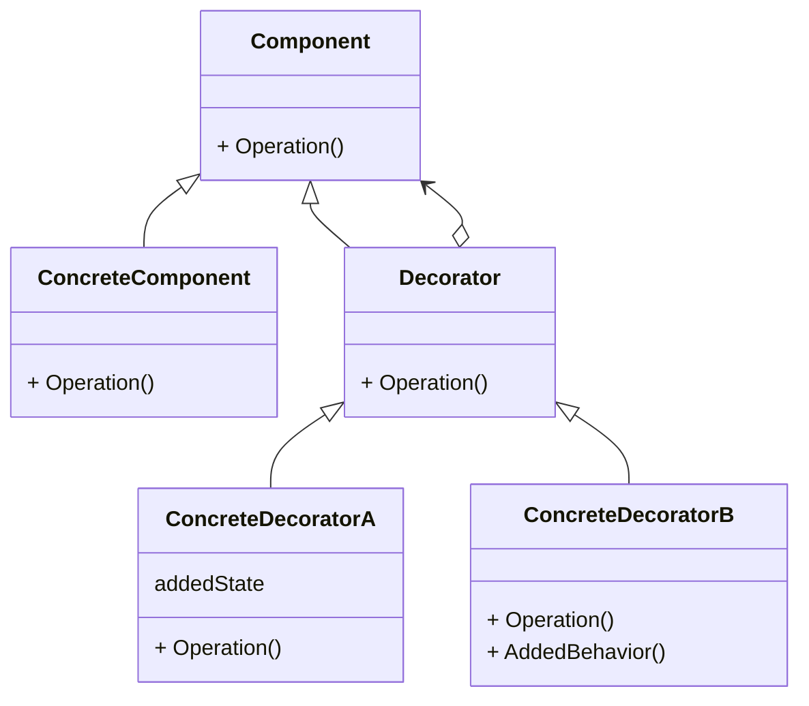

# 动机
- 在某些情况下我们可能会"过度地使用继承来扩展对象的功能", 由于继承为类型引入的静态特质, 使得这种扩展方式缺乏灵活性; 并且随着子类的增多(扩展功能的增多), 各种子类的组合(扩展功能的组合)会导致更多子类的膨胀. 
- 如何使"对象功能的扩展"能够根据需要来动态地实现? 同时避免"扩展功能的增多"带来的子类膨胀问题? 从而使得任何"功能扩展变化"所导致的影响降为最低? 

# 应用场景案例
## 问题描述
- 有一个流的虚基类, 有读/写/定位3种方法
- 派生出文件流, 网络流, 内存流3种具体实现
- 每个具体实现又派生出加密需求, 形成加密文件流, 加密网络流, 加密内存流3个类. 每个流的读/写/定位业务都和非加密流相同, 每个流的读/写/定位的加密业务在3个流中都相同
- 又派生了另外的一系列类, 为缓存文件流, 缓存网络流, 缓存内存流. 情况和加密流类似
- 还可能派生出3个类的缓存加密类, 同时需要缓存和加密

问题中需要的业务可以描述为矩阵, 每一个单元格代表一种需要的业务
|类型\业务|无|加密|缓存|加密缓存|
|-|-|-|-|-|
|**文件**|文件流|加密文件流|缓存文件流|加密缓存文件流|
|**网络**|网络流|加密网络流|缓存网络流|加密缓存网络流|
|**内存**|内存流|加密内存流|缓存内存流|加密缓存内存流|

## 现有方案
[代码](inherit.cpp)
现有代码的问题是编译时装配,需要在编译时就确定每个变量的类型
根据上表, 需要定义12个类, 都是通过继承实现的
每个类中包含读/写/定位3种方法, 都是静态实现的

## 方案改进
用聚合代替继承, 用聚合的灵活性代替继承的固定性
1. 上表中从加密业务开始, 使用虚基类指针, 代替实际的不同文件类型的读/写/定位的调用
    由于不同文件类型的加密读, 加密写, 加密定位的逻辑都是相同的, 因此在使用了聚合的文件类型指针之后, 加密文件流/加密网络流/加密定位流的代码都相同了, 因此可以把3个类进行合并
1. 每个合并的类除了聚合流的虚基类指针, 同时自身也继承于流的虚基类. 继承的目的是保持接口一致(都有读/写/定位3种方法), 聚合的目的是多态调用不同的文件类型的基础方法.
1. 进一步, 由于加密/缓存/加密缓存等不同业务都可以使用相同的合并方式, 考虑再提取公共的部分, 形成一个装饰基类
    **这一步是装饰模式的核心**

[代码](decorator.cpp)
在修改之后, 加密缓存的业务就不需要定义单独的类了. 定义一个缓存类, 其中的虚基类指针传入加密类的指针, 就可以同时实现缓存和加密. 

# 定义
动态(组合)地给一个对象增加一些额外的职责. 就增加功能而言, 装饰模式比生成子类(继承)更为灵活(消除重复代码&减少子类个数). 

装饰的含义就是在主体操作的基础上扩展操作. 在当前案例中, 文件流/网络流/内存流属于主体操作, 加密/缓存属于扩展操作. 

# 要点总结
- 通过采用组合而非继承的手法, 装饰模式实现了运行时动态扩展对象功能的能力, 而且可以根据需要扩展多个功能. 避免了使用继承带来的"灵活性差"和"多子类衍生问题". 
- 装饰类在接口上表现为is-a Component的继承关系, 即装饰类继承了Component类所具有的接口. 但在实现上又表现为has-a Component的组合关系, 即装饰类又使用了另外一个Component类. 
    继承关系表示接口一致, 用于实现装饰方法. 组合关系用于调用主体方法. 
- 装饰模式的目的并非解决"多子类衍生的多继承"问题, 其应用要点在于解决"主体在多个方向上的扩展功能"(装饰功能). 