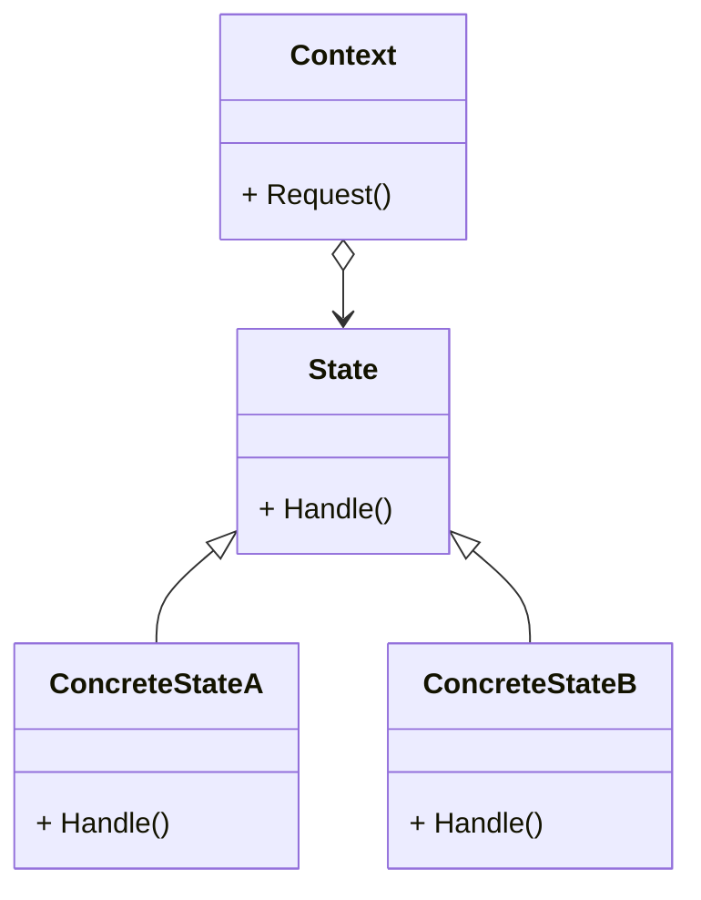

# 动机
- 在软件构建过程中, 某些对象的状态如果改变, 其行为也会随之而发生变化, 比如文档处于只读状态, 其支持的行为和读写状态支持的行为就可能完全不同
- 如何在运行时根据对象的状态来透明地更改对象的行为? 而不会为对象操作和状态转化之间引入紧耦合? 

# 代码示例
## 问题描述
定义网络的3种状态, 有一个业务处理类NetworkProcessor, 内含多种操作, 其中会根据状态的不同执行不同的操作, 并切换状态(状态机)

通常的写法是写出各种状态分支, 在每个分支中实现不同的状态业务以及状态变化
但这样的问题还是违反了开闭原则, 每当状态发生变化, 所有条件分支的代码都要变化
[问题代码](old_state.cpp)

## 状态模式
1. 写一个状态接口类, 内部包括下一个状态的指针, 以及操作纯虚函数
1. 每种状态从接口类派生, 实现每个操作函数, 在每个操作函数中会给下一个状态赋值(状态迁移)
1. 业务处理类NetworkProcessor的操作函数隔离了变化, 只需要用接口类调用自身的操作函数, 然后将状态类指针修改成下一个状态的指针
1. 状态类可以使用单例模式, 在一开始就都创建好

如果需要新增状态, 只需要新增该状态的派生类, 然后实现操作函数, 定义具体的业务和状态迁移
可能还是需要修改现有的状态类, 因为有些现有状态在操作之后可能会变成新状态

# 定义
允许一个对象在其内部状态改变时改变它的行为, 从而使对象看起来似乎修改了其行为

# 要点总结
- 状态模式和[策略模式](../../component%20collaboration/02-Strategy/)很像, 解决的也是相似的问题, 不用纠结模式的名字
- 状态模式将所有与一个特定状态相关的行为都放入一个State子类对象中, 在对象状态切换时, 切换相应的对象; 但同时维持State的接口, 这样实现了具体操作和状态转换之间的解耦
- 为不同的状态引入不同的对象使得状态转换变得更加明确, 保证不会出现状态不一致的情况, 转换是原子性的, 要么不转换, 要么彻底转换
- 如果State对象没有实例变量, 上下文可以共享一个State对象(例子中的单例)